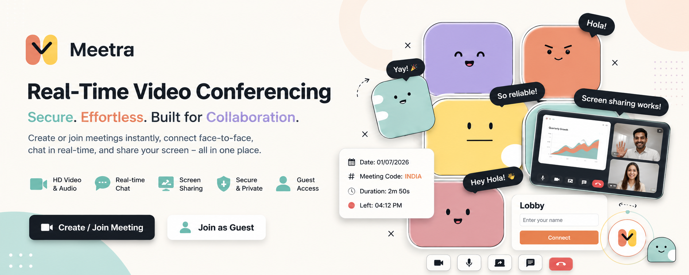
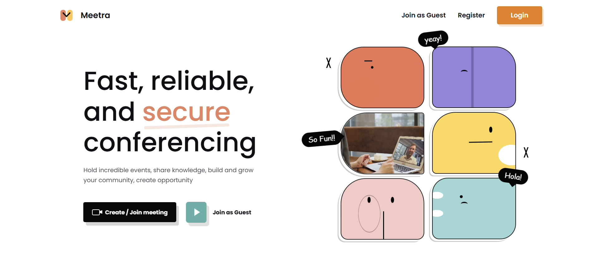
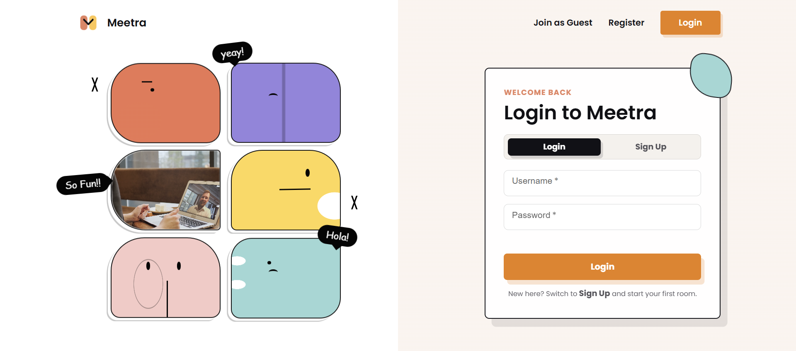
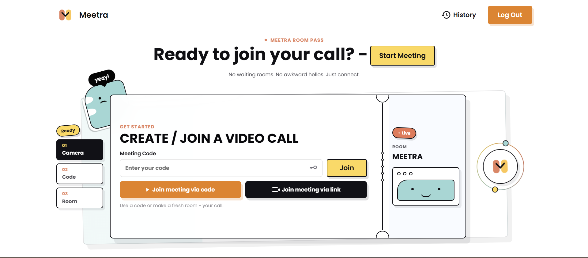
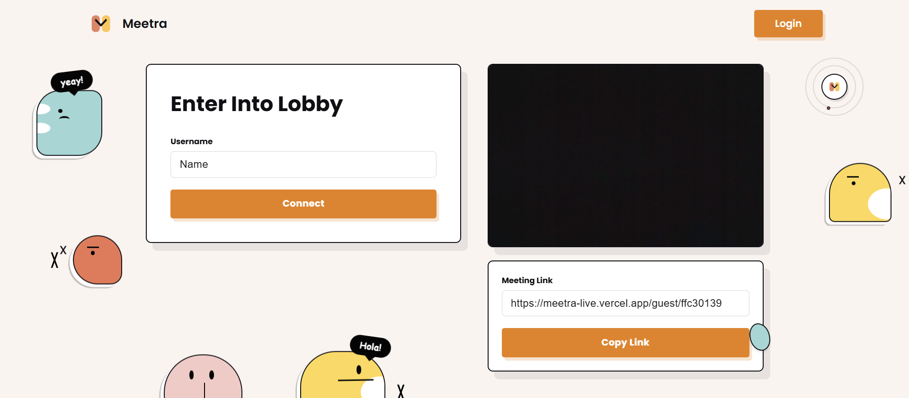
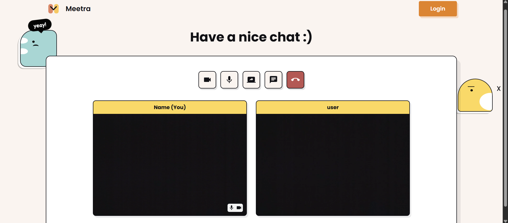
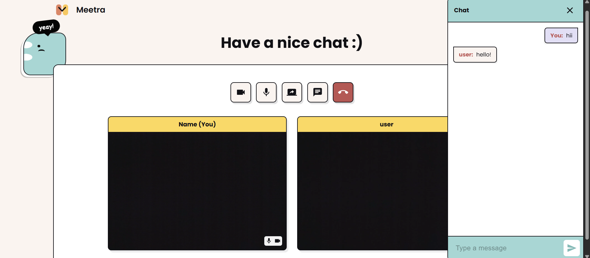
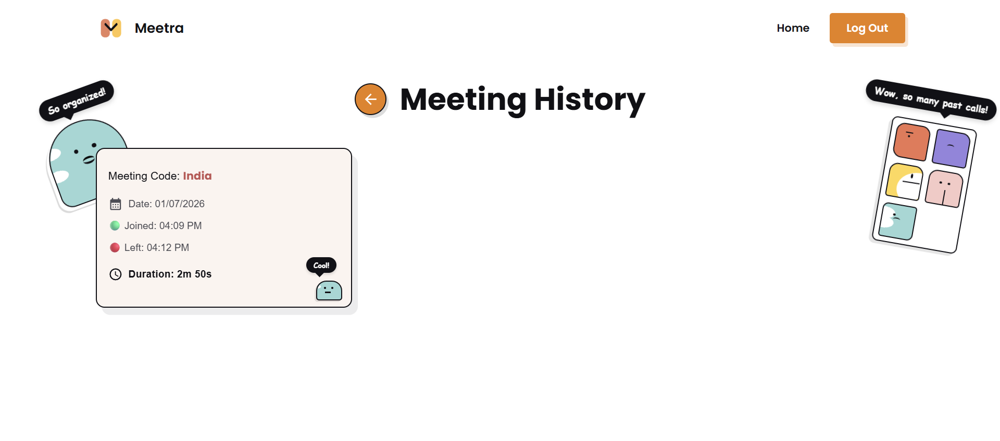

<!-- Banner -->

<p align="center">
  
</p>

<h1 align="center">Meetra</h1>

<p align="center">
  <strong>A Full-Stack Real-Time Video Conferencing Platform</strong>
</p>

<p align="center">
  Built with React, Node.js, Express, MongoDB, WebRTC & Socket.IO
</p>

<p align="center">

[]()
[]()
[]()
[]()
[]()
[]()

</p>

---

# 📖 About

**Meetra** is a full-stack video conferencing application inspired by modern collaboration platforms like Zoom and Google Meet.

The project was built to gain hands-on experience with **WebRTC**, **Socket.IO**, **peer-to-peer networking**, **real-time communication**, and **full-stack application development**.

Users can securely create or join meetings, communicate through high-quality video/audio, chat in real time, and share their screen—all from a responsive web interface.

---

# 🎥 Live Demo

🌐 **Meetra:** https://meetra-live.vercel.app

> **Note:** The backend is hosted on Render's free tier and may take 30–60 seconds to wake up on the first request.

---

# ✨ Features

### 🎥 Video Conferencing

- Real-time peer-to-peer video communication
- High-quality audio calls
- Low latency using WebRTC

### 👥 Meeting Management

- Create a meeting
- Join using Meeting ID
- Guest Join without registration
- Shareable meeting links

### 💬 Live Chat

- Instant messaging
- Chat history for newly joined participants
- Unread message indicator

### 🔒 Authentication

- Secure registration
- Login system
- JWT authentication
- Password hashing using bcrypt

### 🎙️ Media Controls

- Toggle camera
- Toggle microphone
- Screen sharing

### 📱 Responsive UI

- Desktop
- Tablet
- Mobile

---

# 📸 Screenshots

## Landing Page

<p align="center">

</p>

---

## Registration

<p align="center">

</p>

---

## Home 

<p align="center">

</p>

---

## Connect To Users

<p align="center">

</p>

---

## Meeting Page

<p align="center">

</p>

---

## Chat-Box

<p align="center">

</p>

---

## History

<p align="center">

</p>

---

# 🛠 Tech Stack

## Frontend

- React.js
- React Router
- Context API
- Material UI (MUI)
- Axios

## Backend

- Node.js
- Express.js
- Socket.IO

## Database

- MongoDB Atlas
- Mongoose

## Authentication

- JWT
- bcrypt

## Real-Time Communication

- WebRTC
- WebSockets
- Socket.IO

## Deployment

- Vercel
- Render

---

# 🏗 Architecture

```
               React Frontend
                     │
         HTTP + WebSocket (Socket.IO)
                     │
      Express.js + Socket.IO Server
              │                 │
              │                 │
        MongoDB Atlas      WebRTC Signaling
                                │
                     Peer-to-Peer Media
```

---

# 📂 Project Structure

```
Meetra
│
├── frontend/
│
├── backend/
│
├── assets/
│
├── screenshots/
│
├── .gitignore
├── README.md
```

---

# ⚙️ Installation

## Clone the Repository

```bash
git clone https://github.com/YOUR_USERNAME/Meetra.git

cd Meetra
```

---

## Install Dependencies

### Backend

```bash
cd backend
npm install
```

### Frontend

```bash
cd frontend
npm install
```

---

# 🔑 Environment Variables

Create a `.env` file inside the **backend** folder.

```env
PORT=8000

MONGO_URI=your_mongodb_connection_string

JWT_SECRET=your_secret_key

CLIENT_URL=http://localhost:5173
```

---

Create a `.env` file inside the **frontend** folder.

```env
VITE_API_URL=http://localhost:8000/api/v1

VITE_SOCKET_URL=http://localhost:8000
```

---

# ▶️ Run Locally

Backend

```bash
cd backend
npm run dev
```

Frontend

```bash
cd frontend
npm run dev
```

Open

```
http://localhost:5173
```

---

# 🧠 Challenges & Learnings

Building Meetra helped me understand:

- WebRTC signaling
- SDP Offer/Answer negotiation
- ICE Candidate exchange
- Peer-to-peer networking
- Socket.IO room management
- Multi-peer video rendering
- React Context API
- Managing refs for media streams
- Debugging asynchronous real-time applications
- Deploying full-stack applications

---

# 🚀 Future Improvements

- Meeting recording
- Waiting room
- Host permissions
- Raise hand feature
- Emoji reactions
- File sharing
- Virtual backgrounds
- Meeting scheduling
- TURN server integration
- End-to-end encryption

---

# 🤝 Contributing

Contributions are welcome!

1. Fork the repository

2. Create a feature branch

```
git checkout -b feature-name
```

3. Commit changes

```
git commit -m "Added feature"
```

4. Push

```
git push origin feature-name
```

5. Open a Pull Request

---

# 📄 License

This project is licensed under the **MIT License**.

---

# 👨‍💻 Author

**Yash Virugama**

📧 Email: *virugamayash25@gmail.com*

💼 LinkedIn: *https://linkedin.com/in/yashvirugama*

---

## ⭐ Show Your Support

If you found this project helpful or interesting, consider giving it a ⭐ on GitHub.

It motivates me to build and share more open-source projects!
